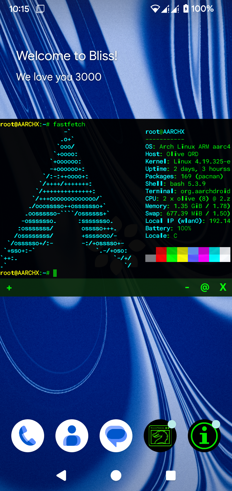
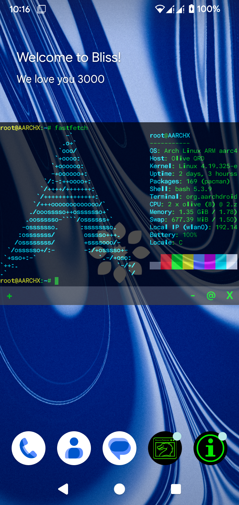
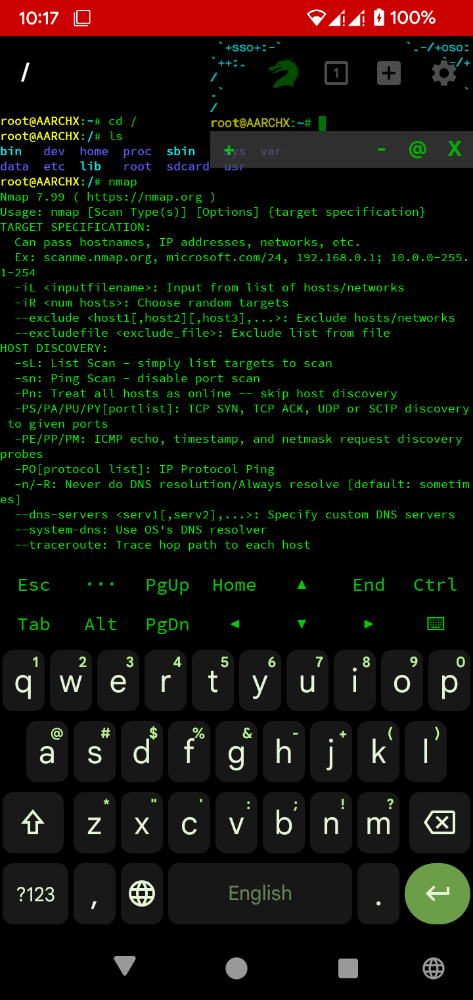
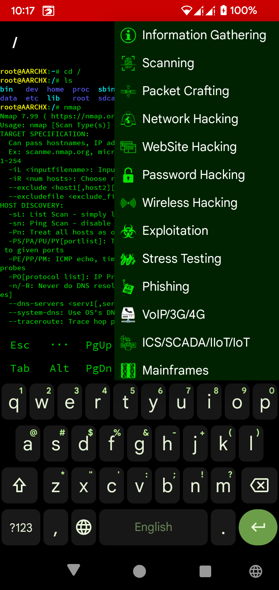
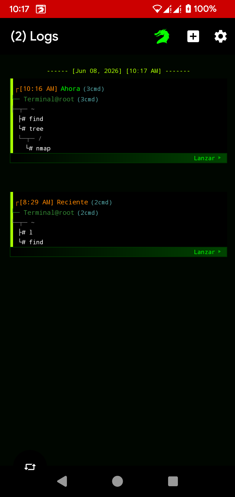
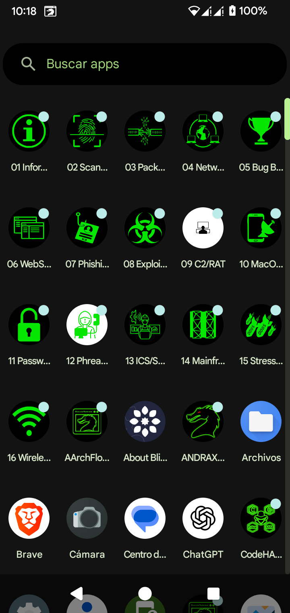

```text
╔══════════════════════════════════════════════════════════╗
║            ANDRAX HACKER'S PLATFORM v7                  ║
║        Linux chroot environment for Android             ║
╚══════════════════════════════════════════════════════════╝
```

Andrax is a Linux chroot environment for Android that runs a full Kali-like toolset directly on your device. It integrates a floating terminal overlay, storage access, and a complete pentesting suite — all inside a single APK.

---

## [>] SCREENSHOTS

<table>
  <tr>
    <td width="50%"></td>
    <td width="50%">
      <b>FLOATING TERMINAL OVERLAY</b><br><br>
      Terminal flotante que se superpone a cualquier aplicación. Soporte completo de shell, teclado, redimensionamiento y minimización. Acceso instantáneo desde cualquier lugar.
    </td>
  </tr>
  <tr>
    <td width="50%">
      <b>OVERLAY CONTROLS</b><br><br>
      Barra de control con botones ASCII: <code>+</code> redimensionar, <code>-</code> minimizar, <code>@</code> teclado, <code>X</code> cerrar. Arrastre desde la barra para mover la ventana.
    </td>
    <td width="50%"></td>
  </tr>
  <tr>
    <td width="50%"></td>
    <td width="50%">
      <b>NMAP & NETWORK TOOLS</b><br><br>
      Nmap, tcpdump, netcat, y todas las herramientas de red funcionando nativamente en el chroot. Escaneo de puertos, enumeración de servicios, análisis de tráfico.
    </td>
  </tr>
  <tr>
    <td width="50%">
      <b>SECURITY TOOLKIT</b><br><br>
      Más de 600 herramientas preinstaladas: Metasploit, Hydra, John the Ripper, Aircrack-ng, SQLmap, Burp Suite, y muchas más. Organizadas por categorías.
    </td>
    <td width="50%"></td>
  </tr>
  <tr>
    <td width="50%"></td>
    <td width="50%">
      <b>TERMINAL & LOGGING</b><br><br>
      Terminal completa con soporte de shell Bash/Zsh, logging de sesiones, y depuración en tiempo real. Acceso al sistema de archivos del chroot y al dispositivo.
    </td>
  </tr>
  <tr>
    <td width="50%">
      <b>STORAGE ACCESS</b><br><br>
      Monta tanto la tarjeta <b>interna</b> como la <b>externa (SD)</b> directamente desde el chroot. Accede a tus archivos, scripts y herramientas desde cualquier directorio.
    </td>
    <td width="50%"></td>
  </tr>
</table>

---

## [>] FEATURES

```text
  ✓ Floating terminal overlay (SYSTEM_ALERT_WINDOW)
  ✓ Full Linux chroot environment (ARM64)
  ✓ 600+ security tools preinstalled
  ✓ Nmap, Metasploit, Hydra, Aircrack-ng, SQLmap
  ✓ Internal & external SD card mounting
  ✓ Minimizable overlay with bubble mode
  ✓ Resizable terminal window
  ✓ Keyboard toggle, drag-to-move
  ✓ Supports Redmi 8 (olive) / SDM439
```

## [>] REQUIREMENTS

```text
  - Android 7.0+ (API 24)
  - Root access (Magisk recommended)
  - 4GB+ free storage for rootfs
  - SYSTEM_ALERT_WINDOW permission (for overlay)
  - ARM64 device
```

## [>] INSTALL

```bash
# 1. Install APK
adb install AArchDroid.apk

# 2. Launch — splash screen detects root & extracts rootfs
# 3. Grant overlay permission when prompted
# 4. Tap "AArchFloat" icon for floating terminal

# Rootfs is extracted automatically to /data/local/aarchdroid/
```

## [>] BUILD FROM SOURCE

```bash
git clone https://github.com/your-repo/aarchdroid
cd AArchDroid
./gradlew assembleDebug
adb install app/build/outputs/apk/debug/app-debug.apk
```

## [>] ARCHITECTURE

```text
  ┌─────────────────────────────────────┐
  │  AArchDroid APK                     │
  │  ┌───────────────────────────────┐  │
  │  │  Float Overlay (FloatService) │  │
  │  │  Terminal Session (Dragon)    │  │
  │  │  Chroot Manager              │  │
  │  │  Tool Launcher (Dco_*)       │  │
  │  └───────────────────────────────┘  │
  │           │                          │
  │           ▼                          │
  │  /data/local/aarchdroid/ (chroot)    │
  │  ├── usr/ (tools, libs, bin)        │
  │  ├── etc/ (config)                  │
  │  └── root/ (home)                   │
  └─────────────────────────────────────┘
```

## [>] CREDITS

```text
  - Dragon Terminal (Terminal Emulator for Android)
  - ANDRAX Team
  - Kernel: LOLZ V29 / CherryKernel (Redmi 8)
  - Based on Debian ARM64 rootfs
```

---

```text
  ╔══════════════════════════════════════════════════════════╗
  ║  "The only secure system is the one that's powered off" ║
  ╚══════════════════════════════════════════════════════════╝
```
